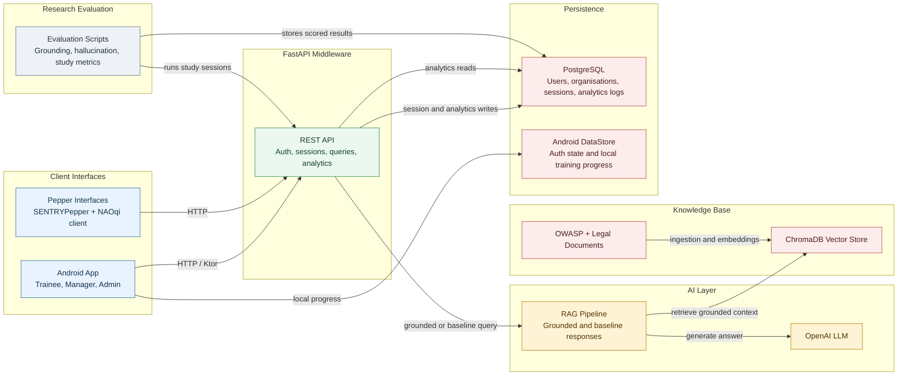

# SENTRY Architecture Diagram

This is the simplified Mermaid source diagram for the current SENTRY system.
It shows the main runtime boundaries and data flow without internal route,
class, or table-level detail.

## Notes

- Clients interact with SENTRY through the FastAPI middleware.
- The middleware owns authentication, session lifecycle, query handling, and
  analytics endpoints.
- Grounded answers use ChromaDB retrieval plus OpenAI generation. Baseline
  answers skip retrieval and use the LLM directly.
- PostgreSQL stores backend analytics and research data. Android DataStore keeps
  local app state and offline training progress.
